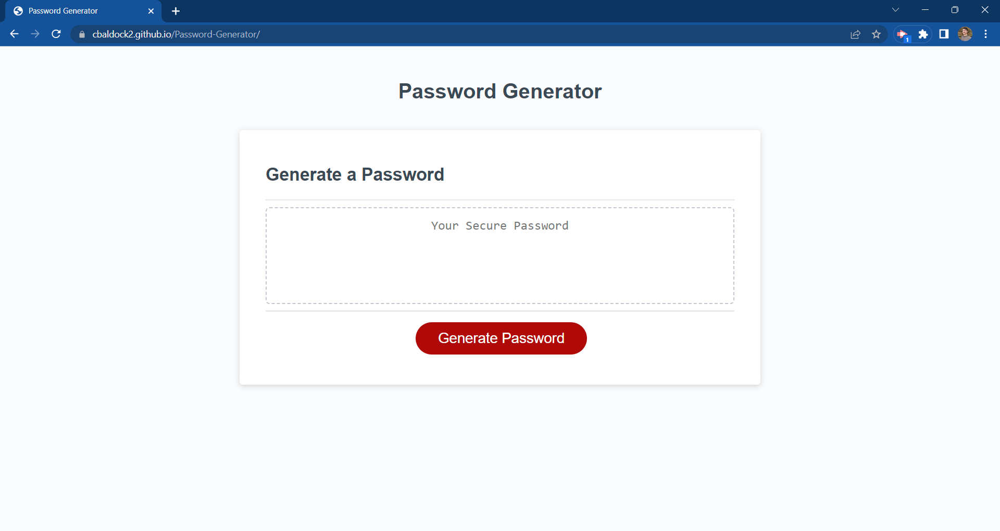
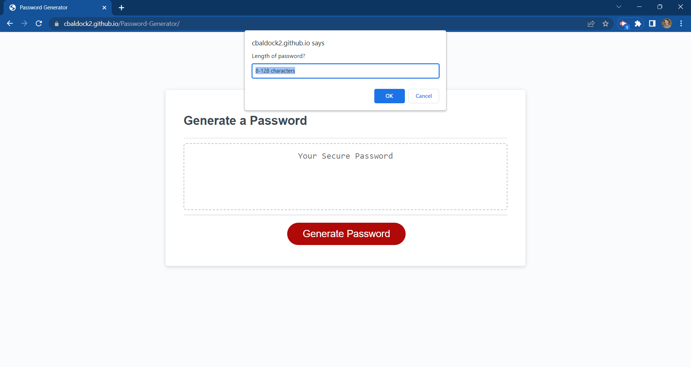

# Password Generator

## Description
My goal with the password generator was to get the program to generate a random password. The website asks prompts and you select the criteria you wish to include in the password. There is a "how long you want" prompt as well as, lowercase, uppercase, numbers, and special characters.

## Installation
N/A

## Usage
To use this application, you simply click the generate password button. Once you have clicked that a prompt appears on screen and asks hot long you would like your password to be. if you dont select anything an alert pops up and says to enter a valid entry. If you enter a number lower than 8 or higher than 128 a different alerts pops up and says to enter a number within the range of 8-128. Afterr you have selected a number between those digits a confirm window pops up asking if you would like lowercase characters, uppercase characters, numbers and/or special characters, you have the option to accept or decline each of the options. If you have decline every option an alert appears saying at least one of the criteria be met. As long as there is one option selected, a random password will generate with whichever options are selected.

## Credits
N/A

## Screenshots

## Link
<a href = "https://cbaldock2.github.io/Password-Generator/"> Password Generator</a>

## License
Please refer to the license in the repo.